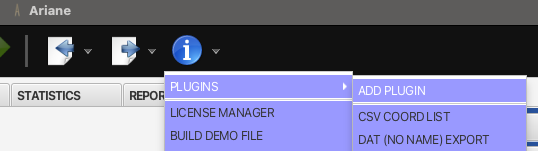
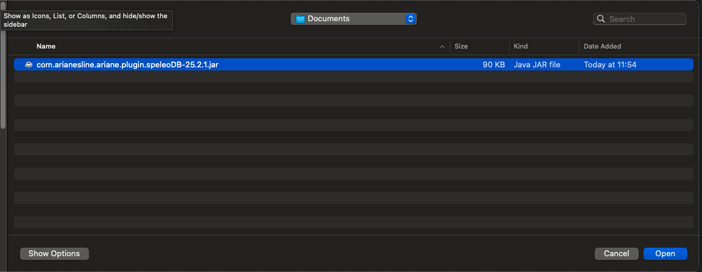
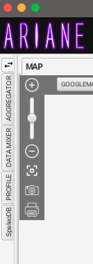
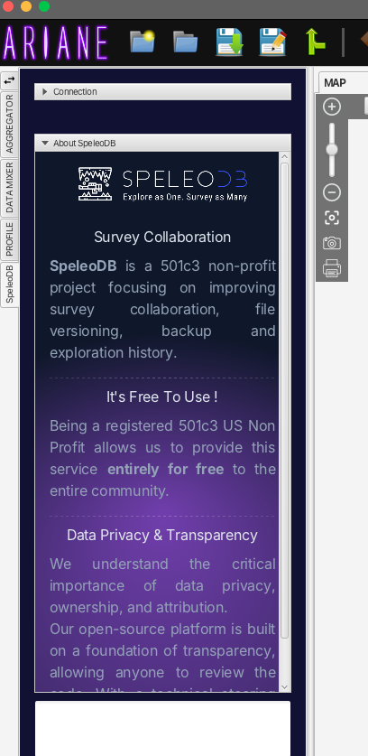
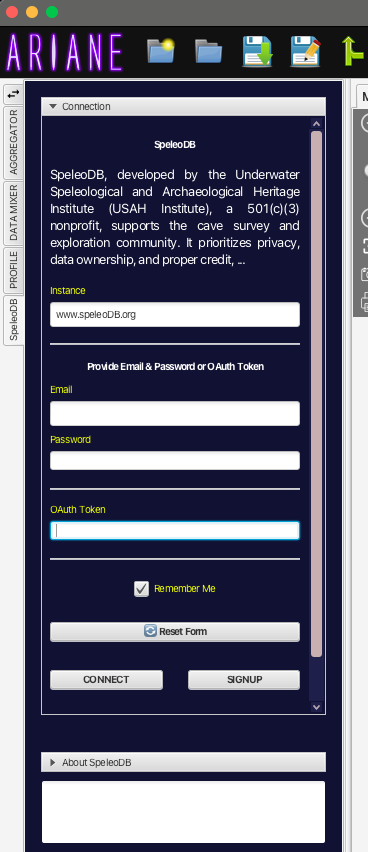
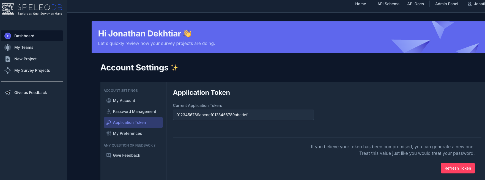
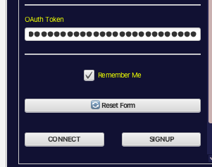
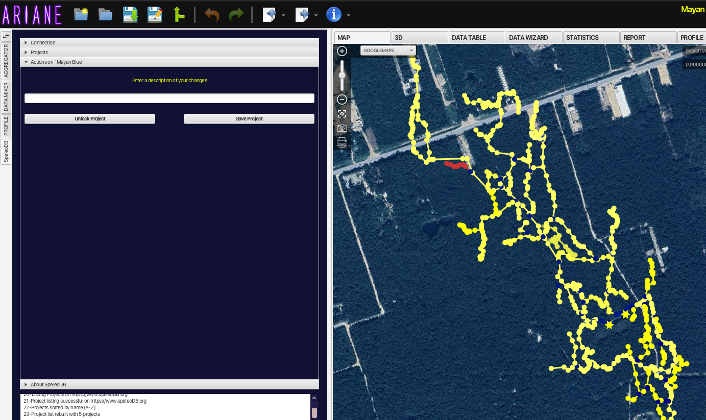
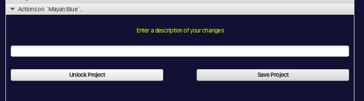

# Ariane-SpeleoDB-Releases

> [!CAUTION]  
> This release is experimental - there will probably be issues -
> please [open an issue](https://github.com/OpenSpeleo/SpeleoDB-Ariane-Plugin/issues/new) or send me a message if you find any abnormal behavior or have any question.

## Installation Instructions:

### 1. Update Ariane

Download and install the latest release of Ariane: https://github.com/Ariane-s-Line/Ariane-Release/releases

> [!NOTE]  
> You need at a **bare minimum** Ariane version `25.2.1` or above.

### 2. Download the SpeleoDB Plugin

Download the latest version of the SpeleoDB Ariane Plugin: [OpenSpeleo/SpeleoDB-Ariane-Plugin/releases](https://github.com/OpenSpeleo/SpeleoDB-Ariane-Plugin/releases).

> [!NOTE]  
> You want the file in `.jar` - ignore the `.zip` and `.tar.gz`.

### 3. Install the SpeleoDB plugin in Ariane

1. Launch Ariane

2. Add a new plugin to Ariane

Click the `I` => plugins => add plugin

1. Select the `.jar` file we just downloaded
   

1. Quit & Restart Ariane

## Usage Instructions:

Congrats 🎉 🎉 🎉  ! You should now see a `SpeleoDB` tab on the left.

1. Open the `SpeleoDB` tab - should look like this (internet connection required from that point)
   

2. Let's connect

Let's click on the `Connection` pane - it should look like this

At this point you have two choices:

  1. Email & Password
  2. Enter your authentication token

If you decide to use the token, open this link: [https://www.speleodb.org/private/auth-token/](https://www.speleodb.org/private/auth-token/)

> [!CAUTION]  
> Treat this `token` as your password ! It will give complete access to your account if you share this "token". 
> **In case you need to change it => click on `Refresh Token` (the red button).**

Let's copy/paste the token in the app and click `CONNECT`

# 3. Opening a project

Once connected you should see appearing the list of project you have access to

Click any of the projects. This will download and load the project you want.

In the background, Ariane acquires the project lock for you (if you have write access and nobody is currently modifying the file).

From that point you can:

- Modify the project and upload a new revision by clicking `Save Project`

- Change project by going back to the `Projects` tab

- Unlock the project and quit Ariane

Hope you have fun ! Feel free to give me any feedback
